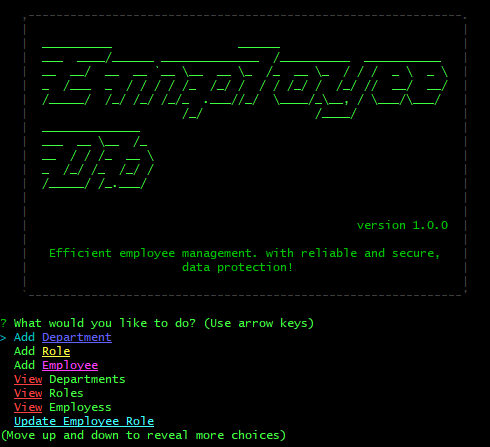
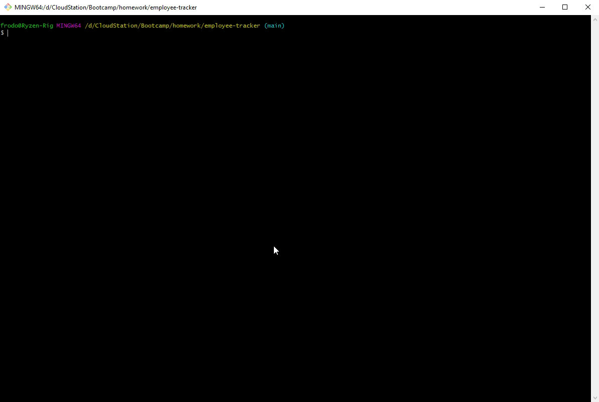

# Employee Tracking Database

This is a CLI employee database. This app allows you to:

<ul>
    <li>View Employees</li>
    <li>View Departments</li>
    <li>View Roles</li>
    <li>Add Employees</li>
    <li>Add Departments</li>
    <li>Add Roles</li>
    <li>Update Employees</li>
</ul>

# Installation

To use this app, run `npm install` to get all the dependencies.

After the installation, you can start the app with the following command:

```
node app.js
```

# Usage

Once you run `node app.js` you will first be prompted the following menu:



#


